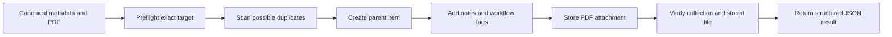

<div align="center">

# Save Papers to Zotero

**A safety-first Codex skill for importing research papers into the exact Zotero collection you choose.**

[](https://github.com/AlexXPZhu/save-papers-to-zotero/actions/workflows/tests.yml)
[](https://www.python.org/)
[](LICENSE)
[](save-papers-to-zotero/)
[](https://www.zotero.org/)

[English](README.md) · [简体中文](README.zh-CN.md)

[Why it helps](#why-this-skill) · [Quick start](#quick-start) · [Examples](#example-workflows) · [Safety](#safety-and-behavior) · [Troubleshooting](#troubleshooting)

</div>

> [!NOTE]
> This is an independent community project. It is not affiliated with or endorsed by Zotero or OpenAI.

## Why this skill

This skill grew out of a practical research-workflow gap. ChatGPT and Codex can help survey a topic and identify a useful set of papers. They can also control Chrome to open those papers, but they cannot flexibly invoke the Zotero Connector browser extension to save the results into the right Zotero collection.

This skill bridges that gap through Zotero's local Connector server. It does more than download a PDF: it creates a structured Zotero item with dependable metadata, preserves information such as arXiv `Comments` in child notes, adds research-workflow tags, stores the PDF, and verifies the final item and attachment.

| Without a structured workflow | With this skill |
| --- | --- |
| Items can land in the wrong collection | The exact target is resolved and revalidated before every write |
| A successful request may still leave no usable PDF | The stored attachment is independently downloaded and verified |
| Comments, notes, and reading state are easy to lose | Child notes and Ethereal Style-compatible tags are applied consistently |
| Batch work can be difficult to resume safely | A manifest, ledger, and lock make serial imports resumable |
| Duplicate handling may be destructive or opaque | Possible duplicates are reported; nothing is deleted, merged, or replaced |



## Highlights

- Imports one paper or a batch into an exact Zotero collection.
- Preserves complete metadata and arXiv Comments as child notes.
- Integrates with the Ethereal Style Zotero plugin by producing its `#status/...` and `#priority/...` workflow tags, without guessing priority.
- Verifies both collection membership and the locally stored PDF.
- Reports possible duplicates while honoring an explicit request to create a new item.
- Uses resumable batch ledgers and per-manifest locking.
- Uses Python's standard library only; no package installation is required.

## Quick start

### 1. Check the requirements

| Requirement | Details |
| --- | --- |
| Codex | A Codex environment that supports skills |
| Python | Python 3.10 or newer; no third-party packages required |
| Zotero | Zotero desktop must be running |
| Local API | In Zotero settings, enable **Allow other applications on this computer to communicate with Zotero** |
| Ethereal Style | Recommended companion Zotero plugin for using the generated `#status/...` and `#priority/...` tags as a research workflow |
| PDF access | You must already have legitimate access to the PDF |

### 2. Install the skill

The easiest method is to ask the built-in `$skill-installer` to install the skill directly from GitHub:

```text
Use $skill-installer to install:
https://github.com/AlexXPZhu/save-papers-to-zotero/tree/main/save-papers-to-zotero
```

The skill becomes available on your next Codex turn.

<details>
<summary>Manual installation fallback</summary>

Copy the repository's `save-papers-to-zotero` directory into your Codex skills directory:

```text
$CODEX_HOME/skills/save-papers-to-zotero
```

If `CODEX_HOME` is not set, the default location is `~/.codex/skills/save-papers-to-zotero`. Restart Codex or begin a new turn after copying it.

</details>

### 3. Prepare Zotero

1. Start Zotero desktop.
2. Create or identify the destination collection.
3. Use its exact name in your request. If names are ambiguous, supply the collection key with `--target-id`.

### 4. Ask Codex to import a paper

```text
Save https://arxiv.org/abs/1706.03762 to my Zotero collection "Reading Queue".
Tag it as to-read and add the arXiv Comments as a child note.
```

## Example workflows

### One paper

```text
Import DOI 10.1145/3290605.3300233 into the exact Zotero collection "HCI".
Save and verify the PDF, and use the reading workflow tag.
```

### A resumable batch

```text
Import every paper in manifest.json into "Thesis Sources" serially.
Keep a resumable ledger and report possible duplicates without deleting anything.
```

See the [batch manifest reference](save-papers-to-zotero/references/batch-manifest.md) for the schema and resume rules.

### Dry run first

```text
Dry-run this paper import into "Reading Queue" and show me the resolved collection,
metadata, tags, PDF source, and possible duplicates without writing to Zotero.
```

### A PDF requiring an authenticated browser session

```text
Save this publisher paper to "Reading Queue". I already have legitimate access in Chrome;
use the browser session only to obtain the PDF, and do not export cookies or session storage.
```

The skill does not bypass paywalls, CAPTCHAs, or access controls.

## Workflow tags

This skill is designed to work with the [Ethereal Style](https://github.com/MuiseDestiny/zotero-style) Zotero plugin. The skill writes ordinary Zotero tags in the naming convention Ethereal Style recognizes; the plugin can then use those tags in its reading-status and priority workflow. Zotero can store the tags without the plugin, but install Ethereal Style to get the intended integrated workflow.

| Requested state | Zotero tag |
| --- | --- |
| `to-read` (default) | `#status/to-read` |
| `reading` | `#status/reading` |
| `none` | No status tag |

Priority is optional and must be explicit: `high`, `medium`, or `low` maps to `#priority/high`, `#priority/medium`, or `#priority/low`. The skill never infers priority from a paper's content.

## Safety and behavior

| Guarantee | Behavior |
| --- | --- |
| Exact destination | The collection is resolved during preflight and revalidated immediately before writing |
| Non-destructive duplicates | Possible duplicates are reported; existing items are never deleted, merged, replaced, or used to silently suppress the requested item |
| Verified PDF | Success with a PDF requires a stored attachment whose bytes download successfully and validate as a PDF |
| Honest failure state | If post-write verification fails, the result says so and warns that the item may already exist |
| Resumable batches | Imports run serially with a ledger and lock; completed entries can be skipped safely |
| Access boundaries | The workflow does not defeat paywalls, CAPTCHAs, authentication, or other access controls |
| Session privacy | Browser-assisted retrieval must not export cookies or session storage |

## Result statuses

| Status | Meaning |
| --- | --- |
| `saved_with_pdf` | Parent item and stored PDF were created and verified |
| `ready` | Dry-run preflight completed; no Zotero write occurred |
| `skipped_completed` | A ledger entry was already completed |
| `skipped_duplicate_in_manifest` | A repeated entry was skipped within the same batch |
| `verification_failed` | A write occurred, but final verification did not pass; inspect Zotero before retrying |
| `not_attempted` | Import was not attempted because a required precondition failed |
| `invalid_pdf` / `http_error` | PDF retrieval or validation failed |

Every script emits structured JSON so a caller can distinguish success, skips, preflight failures, and uncertain post-write states.

## Troubleshooting

| Symptom or code | What to check |
| --- | --- |
| Cannot reach Zotero | Start Zotero desktop and confirm the local Connector server is available |
| `403` or `local_api_disabled` | Enable **Allow other applications on this computer to communicate with Zotero** in Zotero settings |
| `target_not_found` | Check the collection name and use the exact spelling |
| `target_ambiguous` | Supply the intended collection key with `--target-id` |
| `invalid_pdf` | Make sure the source is a direct, valid PDF available to your current access context |
| `verification_failed` | The item may already have been created; inspect Zotero instead of blindly retrying |

## Compatibility and tests

The test suite uses a fake Zotero server and covers metadata, attachments, verification, duplicates, and resumable batch behavior. GitHub Actions runs it on Python 3.10 and 3.12 across Windows, Linux, and macOS.

The current release was also exercised against Zotero 9.0.6 and Connector API v3 on July 18, 2026.

```powershell
python -X utf8 tests/test_importers.py -v
```

## Repository layout

```text
save-papers-to-zotero/
├── .github/workflows/tests.yml
├── save-papers-to-zotero/
│   ├── SKILL.md
│   ├── agents/openai.yaml
│   ├── references/batch-manifest.md
│   └── scripts/
├── tests/test_importers.py
├── README.md
├── README.zh-CN.md
└── LICENSE
```

## Development and privacy

Contributions and focused bug reports are welcome. Keep real PDFs, manifests, ledgers, and other private research data outside the repository or under the ignored `local-data/` directory. The import workflow communicates with Zotero over its loopback Connector server and should never persist browser cookies or session storage.

## License

Released under the [MIT License](LICENSE).
